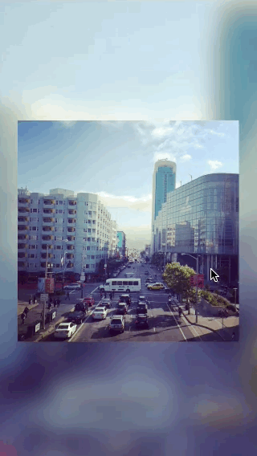

## Episode 003 - Parallax

Composition with a simple parallax effect.
Uses [Origami](http://facebook.github.io/origami/) Scroll and Interaction patches.

| Composition |
| :---------: |
|  |

### Steps

1. Create standard Origami setup with Phone and Render In Image patches.
1. Go inside rendered image and add Clear patch.
1. Add wwdc.jpg to the composition.
1. Background layer.
	1. Add Layer patch.
	1. Attach existing image to this layer.
	1. Scale image.
	1. Add blur.
1. Photo scroll.
	1. Add Scroll patch.
	1. Connect Scroll with the image.
	1. Connect Scroll position to the position of Photo layer.
1. Background scroll.
	1. Connect Scroll position to the position of Background layer.
	1. Add Math patch to modify scroll offset.
	1. Extract Parallax Input Splitter.
1. Scale effect.
	1. Add Interaction 2 patch and connect it with Photo layer.
	1. Add Photo scale change using Multiplexer patch.
	1. Add Bouncy Animation patch to animate scale change.
	1. Do the same for Background layer.
	1. Create macro for Multiplexer and Bouncy Animation.
	1. Use created macro for animating the scale of Photo and Background layers.