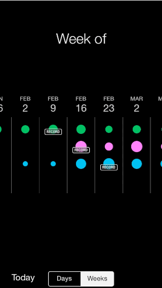
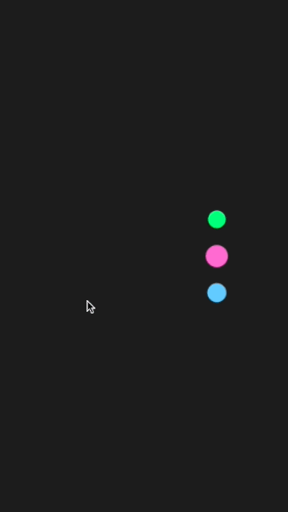

## Episode 004 - Moves

This composition uses Switch patch from Origami. It also shows how you can create and reuse your own patches.
It's inspired by the great [Moves App](http://www.moves-app.com).

 Inspiration | Composition
 :---------: | :---------:
 | 

### Steps

1. Create composition with one static circle.
1. Create composition that animates circle between two states.
1. Create the main composition with 3 circles.
